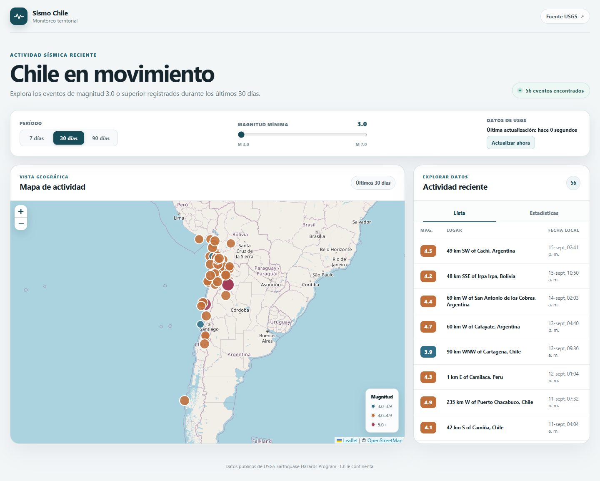

# Sismo Chile

Dashboard interactivo para explorar la actividad sísmica reciente en Chile continental y sus alrededores. Reúne en un mapa, una lista y gráficos los eventos publicados por el [Servicio Geológico de Estados Unidos (USGS)](https://earthquake.usgs.gov/), para que sea fácil observar dónde y cuándo ocurrieron.



[Ver captura en móvil](docs/mobile.png)

## Qué puedes hacer

- Explorar los sismos en un mapa interactivo. El color de cada marcador indica su magnitud y, al seleccionarlo, aparecen el lugar, la fecha y la profundidad.
- Consultar una lista con magnitud, lugar y fecha en la hora local del navegador. Cada evento enlaza a su ficha oficial en USGS.
- Filtrar por los últimos **7, 30 o 90 días** y por magnitud mínima. El mapa, la lista y las estadísticas cambian juntos.
- Ver el total de eventos, la magnitud máxima, el sismo más reciente y gráficos de actividad diaria y distribución de magnitudes.
- Recibir datos nuevos automáticamente cada **90 segundos** o usar «Actualizar ahora». La interfaz indica cuándo se completó la última actualización y permite reintentar si falla la conexión.

## Tecnologías

React, TypeScript y Vite para la aplicación; react-leaflet y OpenStreetMap para el mapa; Recharts para los gráficos. Los datos se consultan directamente desde la API pública de USGS, sin servidor propio ni clave de API.

## Ejecutar en tu computador

Necesitas Node.js 20.19+ o 22.12+ y npm. Clona el repositorio y, dentro de su carpeta, ejecuta:

```bash
npm ci
npm run dev
```

Abre la dirección que indique Vite, normalmente `http://localhost:5173/`. Para comprobar el proyecto también puedes ejecutar `npm run lint` y `npm run build`.

## Sobre los datos

La búsqueda cubre un área rectangular aproximada alrededor de Chile continental, por lo que pueden aparecer eventos cercanos descritos como ocurridos en Argentina, Bolivia o Perú. Las fechas se muestran según la zona horaria de quien abre la página. La información de USGS puede tener demora o estar en caché: **este proyecto es para exploración, no para alertas sísmicas ni decisiones de emergencia**.
